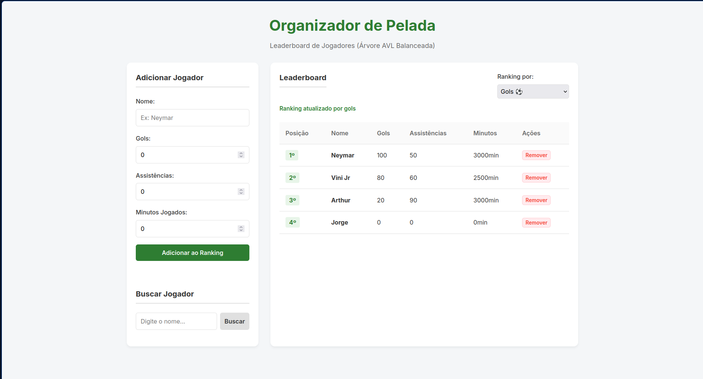

# Organizador de Pelada - Ranking AVL

Conteúdo da Disciplina: Estruturas de Dados (Árvores Balanceadas - AVL)

## Alunos
| Matrícula | Aluno |
| :---: | :--- |
| 231039178 | Pedro Felipe Silva Vargas |

## Sobre
O projeto é um sistema de gerenciamento de jogadores para peladas semanais de futebol, agora focado na aplicação de **Árvores Binárias de Busca Balanceadas (AVL)** para a criação de um ranking dinâmico e eficiente. O sistema utiliza uma Árvore AVL implementada do zero no backend (Python/FastAPI) para garantir que as operações de inserção, busca e remoção ocorram em tempo logarítmico $O(\log N)$, mantendo a árvore sempre balanceada através de rotações (LL, RR, LR, RL).

Nesta versão, o foco é o **Leaderboard**. O usuário pode escolher entre diferentes critérios para ranquear os jogadores:
- **Gols** ⚽
- **Assistências** 🅰️
- **Minutos Jogados** ⏱️

Ao trocar o critério, a árvore é reconstruída dinamicamente e os jogadores são exibidos do maior para o menor placar através de um percurso **In-Order Reverso**.

## Funcionalidades
1. **Ranking Dinâmico**: Escolha o critério (Gols, Assistências ou Minutos) e veja o ranking se atualizar instantaneamente.
2. **Inserção com Balanceamento**: Ao adicionar um jogador, a Árvore AVL realiza rotações automáticas para se manter eficiente.
3. **Remoção Segura**: Delete jogadores do sistema e a árvore se reajusta para manter a propriedade AVL.
4. **Persistência de Dados**: Jogadores são salvos em um arquivo JSON local (`app/players.json`), garantindo que os dados não se percam.
5. **Interface Moderna**: Interface Web responsiva construída com HTML5, CSS3 e JavaScript puro.

## Árvore AVL e Complexidade
A Árvore AVL resolve o problema de degeneração de árvores binárias comuns. Enquanto uma árvore não balanceada pode se tornar uma lista encadeada ($O(N)$), a AVL garante:
- **Busca**: $O(\log N)$
- **Inserção**: $O(\log N)$
- **Remoção**: $O(\log N)$

No console do servidor, você pode acompanhar as rotações sendo realizadas em tempo real para fins didáticos.

## Vídeo
https://youtu.be/wkJ1ST6Y9j4

## Screenshots


## Como Executar (Fácil)

Para facilitar a execução, incluímos scripts que configuram o ambiente e iniciam o servidor automaticamente.

### No Windows:
Basta dar um duplo clique no arquivo **`run.bat`**.

### No Linux / Mac:
Abra o terminal na pasta do projeto e execute:
```bash
chmod +x run.sh
./run.sh
```

---

## Execução Manual (Alternativa)
Se preferir rodar manualmente no terminal:

1. Crie e ative um ambiente virtual:
```bash
python -m venv venv
source venv/bin/activate  # No Linux/Mac
# ou no Windows: venv\Scripts\activate
```

2. Instale as dependências:
```bash
pip install -r requirements.txt
```

3. Execute o servidor:
```bash
python -m uvicorn app.main:app --reload
```
Em seguida, abra o navegador em **http://127.0.0.1:8000**
